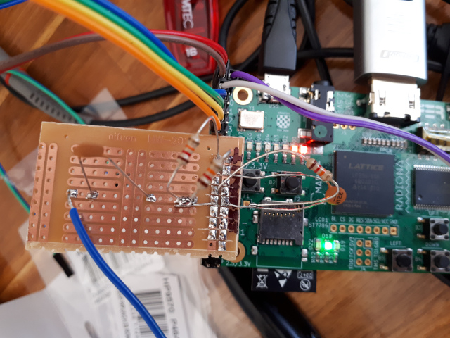

1_bit_AM
========

Attempt at a 1 bit oversampling ADC based AM Radio for ULX3S board.

Based on a few projects on the web such as this one featuring [1-bit SDR on MachX02 board](https://www.rtl-sdr.com/building-a-1-bit-oversampling-sdr-with-not-much-more-than-a-low-cost-fpga/) and this one, a [Nexys board AM radio](https://github.com/dawsonjon/FPGA-radio).

Wiring the ULX3S board
----------------------

To wire the external circuit (same as Alberto Garlassi's - see link above) :

 - Solder dual row header to right hand side of ULX3S
 - Make up a strip board with the following connections:
	- Connect 12k resistor between 3.3V and gp9+
	- Connect 12k resistor between GND and gp9+
	- connect 12k resistor between gp8+ and gp9-
	- connect 220pF cap between gp9- and GND
	- connect 1nF cap between gp9+ and antenna wire (I used 2 - 10 m hookup wire)

 
